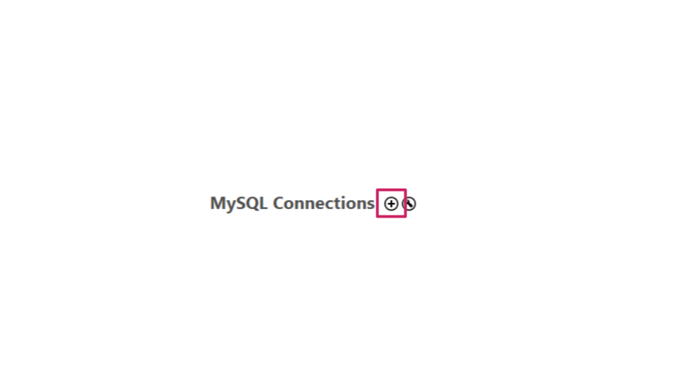
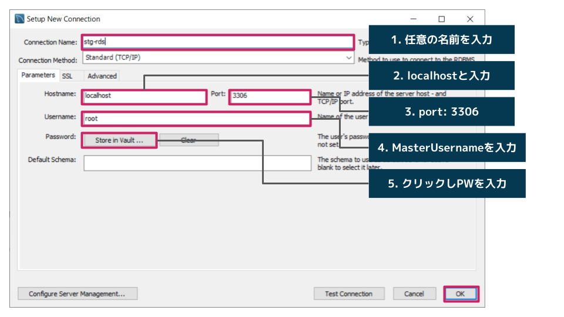
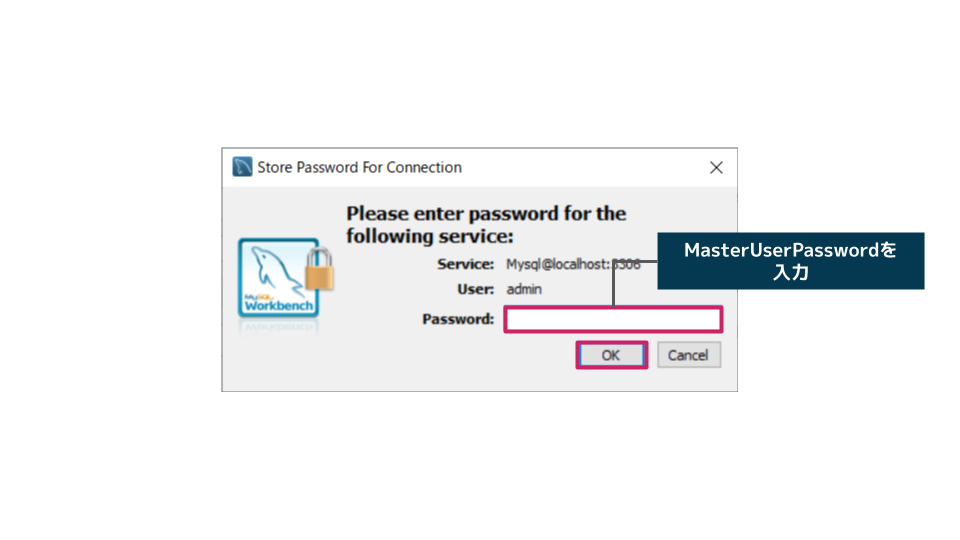

# プライベートサブネットにEC2, RDSを配置し、クライアントツールを使用してRDSへ接続

## deploy手順
> note
>
> - StackNameは適宜任意の名称に置き換えてください。
> - rds.cfgファイルにのDBPasswordは適宜任意のパスワードに変更してください
> - 参考資料各種: 
>   - https://docs.aws.amazon.com/ja_jp/AWSCloudFormation/latest/UserGuide/aws-resource-ec2-vpcendpoint.html
>
>

1. ec2_vpcendpoint1.0.ymlをdeployする

aws cli command
```aws cli
aws cloudformation deploy \
--stack-name StackName \
--template-file ec2_vpcendpoint1.0.yml
--capabilities CAPABILITY_NAMED_IAM
```

2. rds1.0.ymlをdeployする

aws cli command
```aws cli
aws cloudformation deploy \
--stack-name StackName \
--template-file rds1.0.yml
--parameter-overrides $(cat rds.cfg)
```
外部ファイル参照ためrds.cfgファイルを
--parameter-overridesで指定しています。

3. s3bucket1.0.ymlをdeployする
aws cli command
```aws cli
aws cloudformation deploy \
--stack-name StackName \
--template-file s3bucket1.0.yml
```


4. deploy完了後クライアント端末からSession Managerのポートフォワードを開始してリモートホストに接続する

WindowsOSの場合:

以下コマンドをPowerShellで実行します。
```PowerShell
aws ssm start-session `
  --target EC2インスタンスのインスタンスID `
  --document-name AWS-StartPortForwardingSessionToRemoteHost `
  --parameters '{\"portNumber\":[\"3306\"], \"localPortNumber\":[\"3306\"], \"host\":[\"RDSのエンドポイント\"]}'
```

MacOSの場合:

以下コマンドをターミナルで実行します。
```Terminal
aws ssm start-session \
  --target EC2インスタンスのインスタンスID \
  --document-name AWS-StartPortForwardingSessionToRemoteHost \
  --parameters '{"portNumber":["3306"], "localPortNumber":["3306"], "host":["RDSのエンドポイント"]}'
```

以下のようなメッセージが表示されればポートフォワードを開始し、ローカルホストのポート3306をAmazon RDSのポート3306へ転送している状態で接続待ちになっています。

```
Starting session with SessionId: Administrator-03c193d64c5411884
Port 3306 opened for sessionId Administrator-03c193d64c5411884.
Waiting for connections...
```

5. MySQL Workbenchからの接続方法
  - MSQ LWorkbenchを起動し、プラスマークをクリックする

  - Connection Name
  - Hostname
  - Port (デフォルトのまま)
  - Username
  - Password

  上記を入力する


